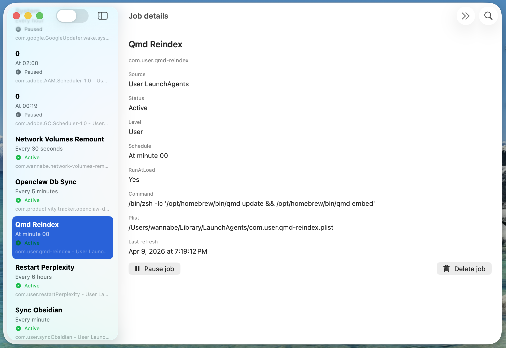

# MacJobs

Tiny native SwiftUI macOS dashboard for inspecting and controlling recurring `launchd` jobs from:

- `~/Library/LaunchAgents`
- `/Library/LaunchAgents`
- `/Library/LaunchDaemons`
- Optional: `/System/Library/LaunchAgents` and `/System/Library/LaunchDaemons`

## Screenshots

### Overview


### Job details



## Features

- Overview screen with:
  - Active user job count
  - Active system job count
  - 5 recent jobs that ran (based on log file modification times)
- Searchable jobs list with friendly names, schedule, and status
- Job details with plist path and command
- Pause / Resume job (`launchctl bootout` / `launchctl bootstrap`)
- Delete job (unload first, then remove plist)
- Permission-aware fallbacks with admin prompt when needed

## Requirements

- macOS 13+
- Xcode Command Line Tools (`xcode-select --install`)

## Build

From project root:

```bash
chmod +x ./build.sh
./build.sh
```

Output app bundle:

```text
dist/MacJobs.app
```

## Quick start

```bash
git clone https://github.com/yborunov/macjobs.git
cd macjobs
chmod +x ./build.sh
./build.sh
open ./dist/MacJobs.app
```

## Install with Homebrew

```bash
brew tap yborunov/tap
brew install --cask macjobs
```

Then launch from Applications or run:

```bash
open /Applications/MacJobs.app
```

## Run

```bash
open ./dist/MacJobs.app
```

## Notes about permissions

- User jobs usually work without admin rights.
- System/local daemons and some vendor-managed agents may require admin rights.
- Jobs in `/System/Library` are system-managed; deletion is intentionally blocked.

## How status is determined

- `Active`: job is currently loaded in `launchd`.
- `Paused`: job appears unloaded.
- `Unknown`: status could not be read (often due to permissions).

## Project files

- `MacJobs.swift` - single-file SwiftUI app source
- `build.sh` - packages `.app`, generates icon, signs app ad-hoc
- `generate_icon.swift` - procedural icon generator

## License

MIT. See `LICENSE`.
